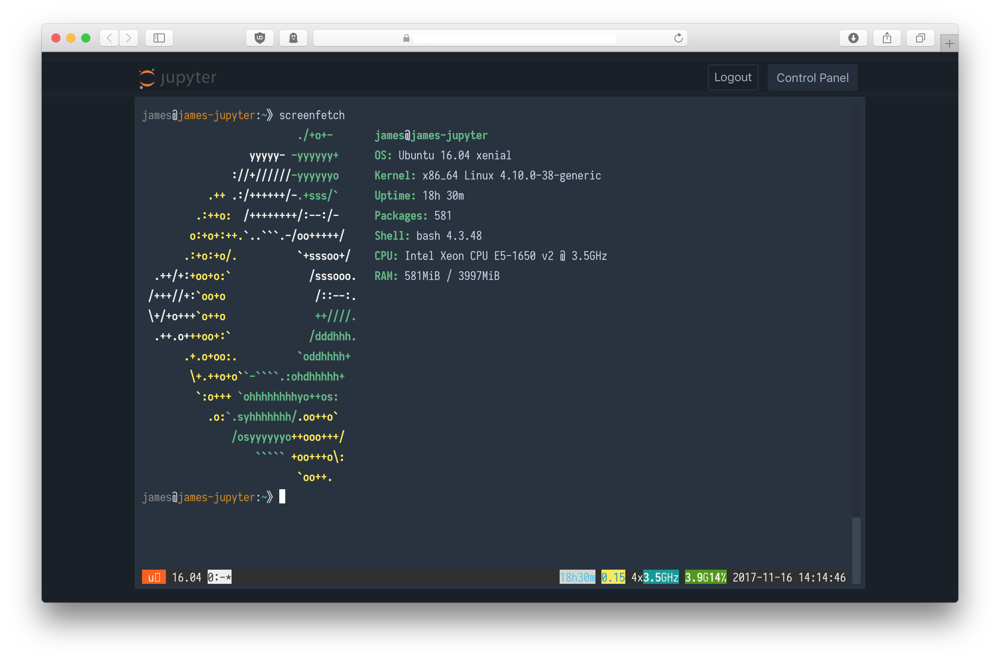

# Jupyter Theme Chesterish Paranoid

> Readability counts. *—The Zen of Python, by Tim Peters*

[Chesterish theme](https://github.com/dunovank/jupyter-themes/blob/master/jupyterthemes/styles/chesterish.less) for Jupyter Notebook is beautiful. However when you need some large font, everything start to fail apart.

So here is a modified Chesterish theme featuring:

 * Dark theme
 * Large font (16pt) to make your eye happier
 * Everything perfectly aligned
 * Use your OS native UI font as Jupyter UI font
 * Use [Iosevka](https://github.com/be5invis/Iosevka) webfont as monospace font

Note: 
  * Tested under Chrome (most recent stable) on Windows and Safari on macOS.
  * If you installed [Sarasa Gothic](https://github.com/be5invis/Sarasa-Gothic) on your computer, it will be used instead of Iosevka. It is recommended if you need CJK font in your Jupyter notebook.

## Screenshots




## Installation

Put the theme under your Jupyter personal config folder (default location is `~/.jupyter/custom`).

```shell
git clone https://github.com/Jamesits/jupyter-theme-chesterish-paranoid.git ~/.jupyter/custom
```

Then restart Jupyter server. (JupyterHub user can restart their own server from URL `/hub/home`.)
